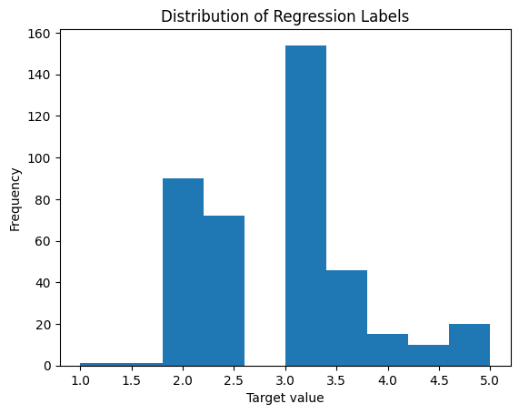
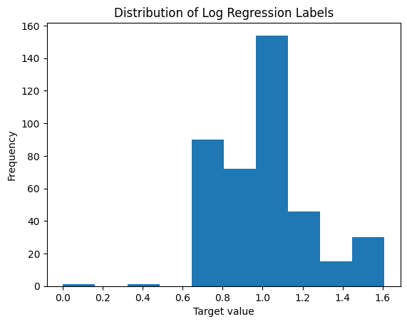
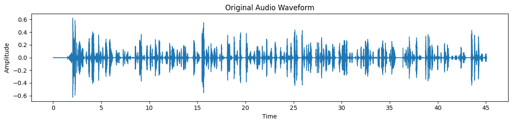
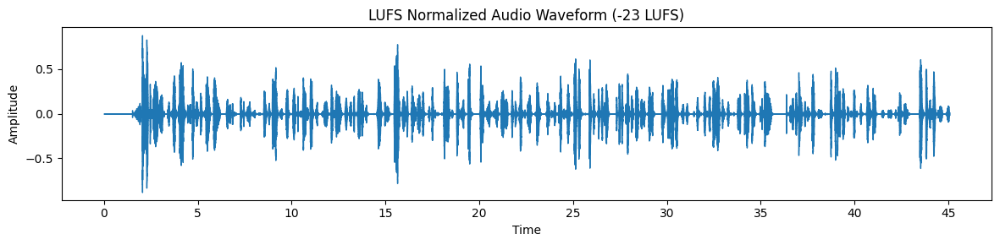
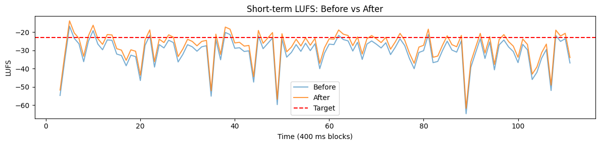

# SHL Grammar Scoring System

This modelling approach takes an .wav audio file as an input and returns a MOS Likert Grammar Scores for each audio instance ranging from 0 to 5.

The current strategy involves using Whisper Large v3 Turbo to extract the transcript from the audio. Then, the same model is used as a feature extractor to form audio embeddings from the LUFS-normalised audios (1280, 1280-dimensional vectors). Deberta v3 Large, which is fine-tuned on the COLA dataset, is used to form text embeddings (1024-dimensional vectors). Both of the embeddings are concatenated (fused) and then passed to an MLP Regressor Head, which transforms the input into 512, 128, and 1-dimensional vectors, where the last representation yields the output. The model predicts the log1p transformation of the MOS Scores, and they are then scaled back. Only the MLP regressor is trained, and the weights of the Text and WAV Encoders are kept frozen.

The current approach adopted an 80:20 train-validation split, obtaining an RMSE score of 0.461 and a Pearson Correlation Coefficient of 0.802 on the training dataset, which achieved a score of 0.471 on the Public Leaderboard.

## Training Hyperparameters

| Hyperparameter         | Value                              |
|------------------------|------------------------------------|
| Random Seed            | 42                                 |
| Sample Rate            | 16000                              |
| Batch Size             | 4                                  |
| Train-Val Split        | 80%:20%                            |
| Text Encoder           | yiiino/deberta-v3-large-cola       |
| Wav Encoder            | openai/whisper-large-v3-turbo      |
| MLP Regressor          | 2304 -> 512 -> 128 -> 1            |
| Activation Function    | ReLU                               |
| MLP Regressor: Dropout | 0.4, 0.3                           |
| Epochs                 | 150                                |
| Loss Function          | Mean Squared Error (MSE)           |
| Optimizer              | AdamW                              |
| Learning Rate          | 1e-4                               |
| Early Stopping Patience| 5                                  |
| Scheduler              | ReduceLROnPlateau                  |
| Scheduler Factor       | 0.5                                |
| Scheduler Patience     | 1                                  |

## Model Architecture

<Put Image>

## EDA

#### Log Transformation on Targets

Observation 1 : Log doesn't change the distribution of labels since it is a monotonic function

Conclusion 1 : Log of Targets can be chosen as a label as well

#### Skewness and Kurtosis of Targets and log(Targets)

| Variable          | Skewness | Kurtosis |
|-------------------|----------|----------|
| MOS_Score         | 0.917    | 0.925    |
| log(MOS_Score)    | 0.128    | 0.239    |

Observation 2: Log of Target MOS Scores show low skewness and kurtosis as compared to the raw targets

Conclusion 2: Log of Target MOS Scores resemble the Normal Distribution better than the raw targets

#### Waveforms Before and After LUFS Normalization

Observation 3: LUFS Normalization doesn't inherently change the waveforms

Conclusion 3: LUFS Normalization may be considered for pre-processing

#### Short-term LUFS Before and After LUFS Normalization

Observation 4: LUFS Normalization shifts the LUFS slightly

Conclusion 4: LUFS Normalization might be tested as pre-processing for getting better on metric

## Experimentation

The following model combinations were also tried and the metric obtained are written in front of them:
| Models                                                                 | Val RMSE | Val CC | Training RMSE (Complete) | Training CC (Complete)| Public LB |
|------------------------------------------------------------------------|----------|--------|---------------|-------------|-----------|
| Wav2Vec2                                                               | 0.727    | 0.360  | 0.712         | 0.411       | 1.011     |
| Roberta Large                                                          | 0.691    | 0.454  | 0.687         | 0.466       | 0.863     |
| Wav2Vec2 + Roberta Large                                                | 0.620    | 0.593  | 0.548         | 0.723       | 0.719     |
| Whisper v3 Large Turbo + Deberta v3 Large                               | 0.526    | 0.726  | 0.489         | 0.776       | 0.487     |
| Whisper v3 Large Turbo + Deberta v3 Large COLA                          | 0.497    | 0.773  | 0.446         | 0.819       | 0.479     |
| **Whisper v3 Large Turbo + Deberta v3 Large COLA + LUFS Normalization** | **0.515**|**0.739**  | **0.461**         | **0.802**       | **0.471**     |
| Whisper v3 Large Turbo + GTE Qwen 2 Instruct 1.5B                       | 0.787    | 0.339  | -             | -           | -         |

## Final Model Metrics

Model: Whisper v3 Large Turbo + Deberta v3 Large COLA + LUFS Normalization 
Validation RMSE: 0.515
Validation Correlation Coefficient: 0.739
Training Dataset RMSE (Complete): 0.461
Training Dataset Correlation Coefficient (Complete): 0.802
Public Leaderboard Score: 0.471
